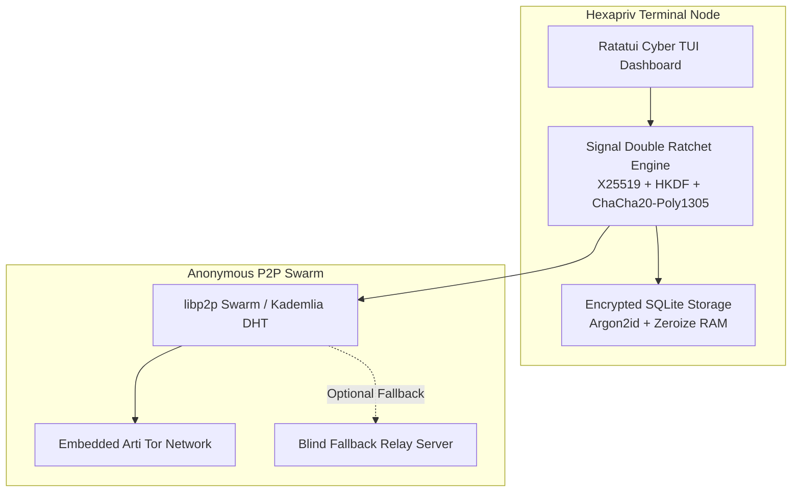

<div align="center">

# HEXAPRIV
### Enterprise-Grade Zero-Knowledge, Serverless P2P Terminal Messenger

[](https://www.rust-lang.org/)
[](LICENSE)
[](https://gitlab.torproject.org/tpo/core/arti)
[](https://signal.org/docs/specifications/doubleratchet/)
[](TOR_COMMUNICATIONS_GUIDE.md)

*Powered by **Signal Protocol Double Ratchet E2EE**, **libp2p Swarm**, **Embedded Arti Tor Engine**, and a **Cyberpunk Red & Black Ratatui TUI**.*

[Quick Start](#quick-start--installation) • [Architecture](#architecture--security-model) • [CLI Reference](#cli--command-reference) • [Tor Routing](TOR_COMMUNICATIONS_GUIDE.md) • [Threat Model](#forensic-threat-model)

---

</div>

## Overview

**Hexapriv** is a next-generation, serverless, peer-to-peer terminal communication platform engineered for high-assurance privacy, resistance against surveillance, and complete metadata elimination. Built natively in **Rust**, Hexapriv combines military-grade end-to-end cryptography with embedded onion routing and direct peer discovery—all presented through a real-time red & black terminal dashboard.

```text
  █░█ █▀▀ █░█ █▀█ █▀█ █░█ █░█
  █▀█ ██▄ ▀▄▀ █▀█ █▀▀ █░█ ▀▄▀
  -------------------------------------------------------------
  [E2EE: SIGNAL DOUBLE RATCHET]  [TRANSPORT: LIBP2P + TOR ARTI]
  [FORENSIC: DURESS SILENT WIPE] [TUI: RED & BLACK RATATUI]
```

---

## Key Features

| Feature | Enterprise Benefit & Technical Implementation |
| :--- | :--- |
| **Signal Double Ratchet E2EE** | **Forward Secrecy & Post-Compromise Security**: Continuous X25519 Diffie-Hellman & HKDF-SHA256 ratcheting for every message payload. |
| **Serverless libp2p Swarm** | **Zero Central Metadata**: Kademlia DHT peer discovery, Noise authenticated transport, and direct node-to-node CBOR messaging. |
| **Embedded Arti Tor Engine** | **Native IP Concealment**: Integrated Rust Tor client (`arti-client`) bootstraps anonymized circuits without external binaries or proxies. |
| **Duress & Forensic Wipe** | **Anti-Coercion Protection**: Dual-passcode system (Code A vs. Code B). Triggering Code B or `/wipe` zeroes all identity keys and databases instantly. |
| **Cyberpunk Ratatui TUI** | **High-Efficiency Operator UX**: Real-time terminal interface with dynamic network indicators, peer swarm sidebar, and QR verification modals. |
| **Zeroize Memory Protection** | **RAM Scavenging Defense**: Secret keys, derived keys, and plaintext buffers implement `zeroize::ZeroizeOnDrop` to scrub RAM automatically. |

---

## Architecture & Security Model



### Cryptographic Primitive Stack
- **Key Exchange & Ratcheting**: X25519 Diffie-Hellman (Curve25519), HKDF-SHA256 Key Derivation.
- **Symmetric Encryption**: ChaCha20-Poly1305 Authenticated Encryption with Associated Data (AEAD).
- **Key Storage Encryption**: Argon2id password hashing + ChaCha20-Poly1305 encryption key wrapping.
- **Transport Security**: Noise Protocol Framework (Noise_XX handshakes over Yamux multiplexing).

---

## Quick Start & Installation

### Prerequisites
- **Linux / macOS / BSD** operating system
- **Rust Toolchain** 1.75+ (`rustc`, `cargo`)
- Standard C compiler and development toolchain (`gcc`, `make`)

### Automated One-Line Installation

```bash
cd "/home/johnny/Documents/Projects/Privacy Text"
./install.sh
```

`install.sh` builds the release binary with embedded SQLite, installing `hexapriv` directly into `$HOME/.local/bin/hexapriv` and `$HOME/.cargo/bin/hexapriv`.

### Build from Source

```bash
# Clone the repository
git clone git@github.com:Nilesh-hash07/HexaPriv.git
cd HexaPriv

# Build optimized release binary
cargo build --release --all-targets

# Run test suite
cargo test --workspace
```

---

## CLI & Command Reference

### Execution Commands

```bash
# Launch pure P2P node on default port (4001) with Red & Black TUI
hexapriv

# Start node on a custom TCP port
hexapriv p2p 5001

# Launch P2P node with embedded Arti Tor onion routing enabled
hexapriv tor

# Connect via blind fallback relay server
hexapriv connect http://127.0.0.1:8080

# Launch zero-log blind relay server daemon (Port: 8080)
hexapriv serve 8080

# Verify out-of-band identity SHA-256 fingerprint
hexapriv verify <FINGERPRINT>

# Trigger instant duress forensic wipe from command line
hexapriv wipe
```

---

## Interactive Dashboard Manual

Inside the active Hexapriv terminal interface:

| Key / Command | Action |
| :--- | :--- |
| `/send <pubkey_hex> <msg>` | Encrypts payload via Signal Double Ratchet and transmits over libp2p swarm. |
| `/connect <multiaddr>` | Dials target peer multiaddress (e.g. `/ip4/198.51.100.4/tcp/4001/p2p/12D3...`). |
| `/delete <conv_id>` | Destroys local session ratchet state and conversation log permanently. |
| `/verify <fingerprint>` | Performs out-of-band SHA-256 fingerprint comparison. |
| `/wipe` | Instantly overwrites identity keys, databases, and local RAM state. |
| `Ctrl + A` / `Esc` | Opens full un-clipped Network Connection Addresses modal window. |
| `Ctrl + Q` / `Esc` | Displays the out-of-band Identity Verification QR Code overlay. |
| `Ctrl + C` | Emergency exit application. |

---

## Forensic Threat Model

### 1. Anti-Coercion Duress System
During initialization, Hexapriv prompts for two separate access credentials:
- **Code A (Operational Key)**: Authenticates session and decrypts operational identity.
- **Code B (Duress Silent Wipe Key)**: **Emergency trigger**. Entering Code B at login silently zero-fills identity keys, deletes session data, outputs a generic decoy response, and exits without throwing alerts.

### 2. Zeroize Memory Management
All sensitive variables—including master keys, ephemeral Diffie-Hellman secret scalars, and unencrypted message buffers—are wrapped with `zeroize::ZeroizeOnDrop`. Memory is scrubbed at the hardware/CPU level immediately upon scope departure.

### 3. IP Metadata Concealment
Network listeners filter out internal local area network IPs (`192.168.x.x`, `10.x.x.x`) during address announcements, preventing local topology exposure over Tor peer discovery.

For comprehensive details on onion circuit setup and hidden service routing, refer to [TOR_COMMUNICATIONS_GUIDE.md](TOR_COMMUNICATIONS_GUIDE.md).

---

## Contributing & Security Disclosures

Contributions, security audits, and pull requests are welcome!

1. Fork the Repository.
2. Create a Feature Branch (`git checkout -b feature/cyber-improvement`).
3. Commit changes (`git commit -m 'feat: Add quantum-safe key exchange extension'`).
4. Push to branch (`git push origin feature/cyber-improvement`).
5. Open a Pull Request.

> **Security Advisory**: To report security vulnerabilities, please contact the maintainers directly or submit a GPG-encrypted advisory.

---

## License

Distributed under the **MIT License**. See `LICENSE` for more information.

<div align="center">

**[Star HexaPriv on GitHub](https://github.com/Nilesh-hash07/HexaPriv)** — Built for Privacy, Freedom, and Security.

</div>
